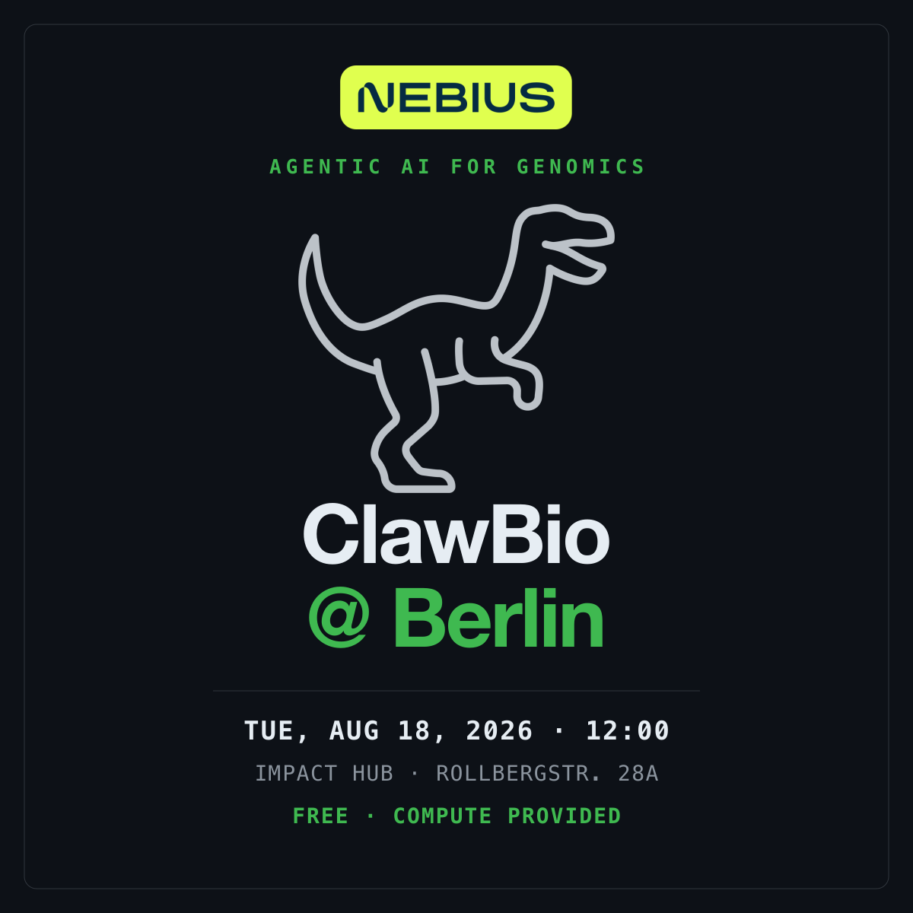

# ClawBio + Nebius Hackathon Berlin

  Event
  Tuesday 18 August 2026

{ width="420" style="border-radius: 12px; margin: 1.5rem 0;" }

**Agentic AI for Genomics.** One day, real data, real compute. You build with ClawBio
skills on Nebius infrastructure and demo what you made at half four.

[Register on Luma](https://luma.com/clawbio-q8pw){ .md-button .md-button--primary }

## Where and when

| | |
|---|---|
| **Date** | Tuesday 18 August 2026 |
| **Doors** | 11:30 |
| **Programme** | 12:00 to 18:00 |
| **Venue** | Impact Hub Berlin, room "The Loop" |
| **Address** | Rollbergstraße 28a, 12053 Berlin |
| **Cost** | Free, and lunch is provided |

Come at 11:30 if you can. We start at 12:00 sharp, and the earlier you are set up on
Nebius the more you build.

## What you will build

AI agents can now plan multi-step work, call tools, run analyses, read their own outputs
and recover from failure. Biology is where that gets hard, because it demands
reproducibility, provenance, traceable evidence, and knowing when to abstain.

ClawBio is the open infrastructure for that: agents perform scientific work through
explicit, versioned, auditable skills, so what an agent did can be inspected, reproduced
and challenged. The library ships more than 90 skills and bridges to more than 8,000 Galaxy tools,
so you start from a working pattern rather than a blank page.

You will spend the afternoon on a real genomics problem, not on plumbing. You drive an
agent, and it reads the skill library, runs the analyses and chains them together. You
will not be typing commands all day, and there is nothing to install: Nebius provide a
hosted environment you reach with a URL and a token. The programme provides 2 hours 50
minutes of build time.

The premise for the day is one sentence. **A model that confidently invents a citation is
worse than one that says it does not know.** Everything is built around grounding and
provenance rather than making a model sound convincing.

## Running order

| Time | Session |
|------|---------|
| 11:30 | Doors open. Arrive, get set up on Nebius |
| 12:00 | Welcome, then genomics in an agentic world, an overview (20 min) |
| 12:20 | Introduction to Nebius products (15 min) |
| 12:35 | Using and developing ClawBio skills on Nebius, a primer (30 min) |
| 12:55 | The three challenges, and how demos are judged |
| 13:05 | Team formation and lunch |
| 13:20 | Build |
| 16:10 | Submissions freeze in `#berlin-demos` |
| 16:30 | Demos, jury decision and the community vote |
| 18:00 | Close |

Build time is **2 hours 50 minutes**, 13:20 to the 16:10 freeze. That is the constraint
every challenge is designed around, and it is worth internalising before you scope your
idea.

## Challenges

Three real problems in genomics. Pick one. The same prize pool applies across all three.

- **1. End the diagnostic odyssey**

    A public four-person exome pedigree and hundreds of candidate variants. Show the
    segregation evidence, then be explicit about what cannot be concluded without a
    clinical phenotype.

- **2. A cancer target you would defend**

    Pick a tumour type in TCGA and shortlist targets. For each one, make the case against
    it as visible as the case for it. Show us a target you killed.

- **3. Whose genome does this fail?**

    Take a published polygenic score, apply it across ancestries, and find where it stops
    meaning anything. Then build the agent that declines to report it.

Not your field? There is an **open challenge** too: bring your own question and we will
scope it with you at 13:05.

**How** you build is a separate choice you make inside your challenge: write a new skill,
chain existing ones, or, if participant Serverless access is confirmed, host an open
model on Nebius and call it as a tool. Any available route counts on any challenge.

Each brief comes with a prompt you paste straight into the agent, so your first hour
starts with the science rather than with setup.

[Full briefs and judging](tracks.md){ .md-button }
[Challenge data](data/index.md){ .md-button }

## Prizes

The best projects receive Nebius AI Cloud and Token Factory credits to keep building
after the day.

| Place | Nebius AI Cloud | Token Factory |
|-------|-----------------|---------------|
| 1st | $1,500 | $500 |
| 2nd | $1,000 | $250 |
| 3rd | $500 | $100 |

**A jury chooses those three**, on originality, impact, and how well the project uses
Nebius and ClawBio.

**There is also a community prize**, chosen by the room.

## What to bring

A laptop, and enough Python to be dangerous.

You do **not** need prior ClawBio experience, and you do not need to have used AI coding
agents before.

**There is nothing to install.** Your Nebius link and token are posted in
`#berlin-general` on Slack. Open the link, paste the token, click Connect, and you are in
the **BioNeMo Research Agent** running on Nebius. Everything happens in your browser.

Join the Slack before you arrive, so you are not hunting for credentials at 12:00.

Then paste a challenge prompt and start. [Setup](setup.md) has the connection detail, and
[the data](data/index.md) is ready for all three challenges.

If you would rather work on your own machine, everything is open source and the briefs
carry the exact local commands.

## Teams

Teams of four to five, formed at 13:05. Four to five is the sweet spot: smaller teams
stall, larger ones leave people idle.

You do not need to arrive with a team. Most people do not.

## Getting help

Support runs in Slack for the whole day, and starts now rather than on Tuesday. Team
formation happens in `#berlin-teams` before the event, so the earlier you join the better
your first hour goes.

[Join the ClawBio Slack](https://join.slack.com/t/clawbioworkspace/shared_invite/zt-46i2vb0gl-k6XHMJdUWE48odbfmONGFg){ .md-button .md-button--primary }

| Channel | For |
|---------|-----|
| `#berlin-general` | **Your Nebius link and token**, plus announcements |
| `#berlin-help` | Stuck on anything. Nebius engineers are in here |
| `#berlin-teams` | Say what you want to build, find people to build it with |
| `#berlin-demos` | Post your repo and one line before 16:10 |

## Hosts

Run by [ClawBio](https://github.com/ClawBio/ClawBio) with
[Nebius](https://nebius.com), who provide the compute and the Token Factory credits.

ClawBio is open source and the skills you write on the day can be contributed back to
the library.
