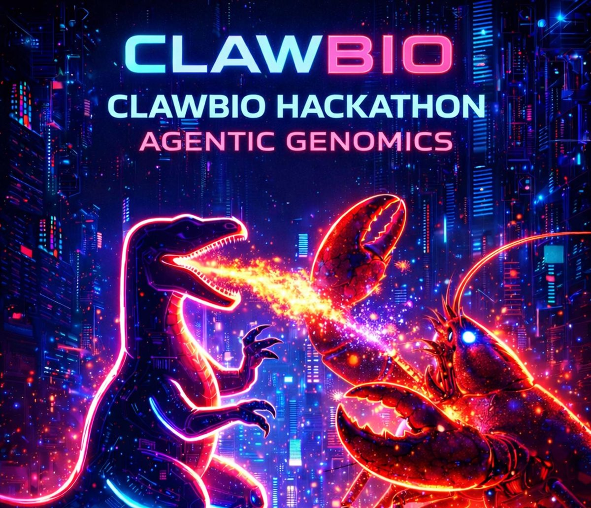
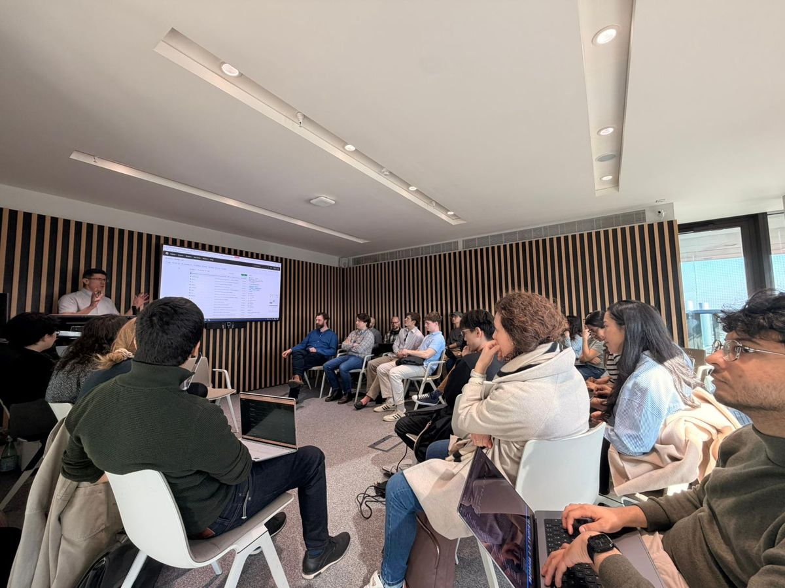
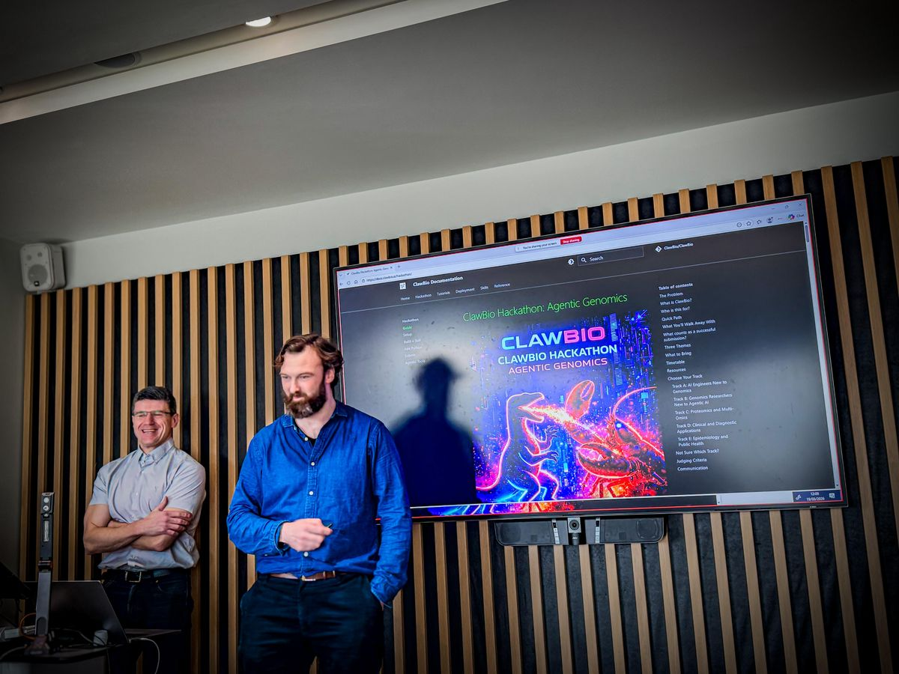
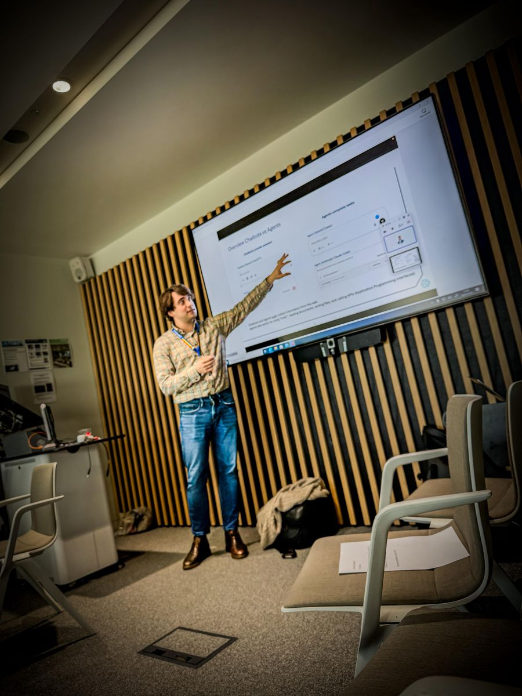
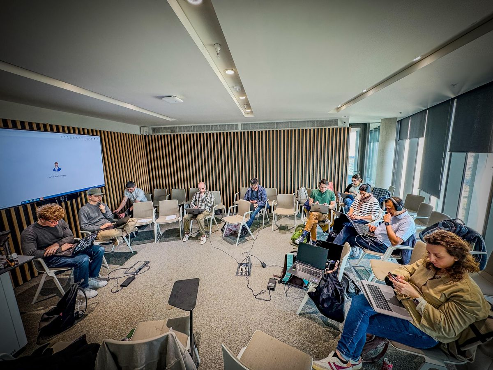
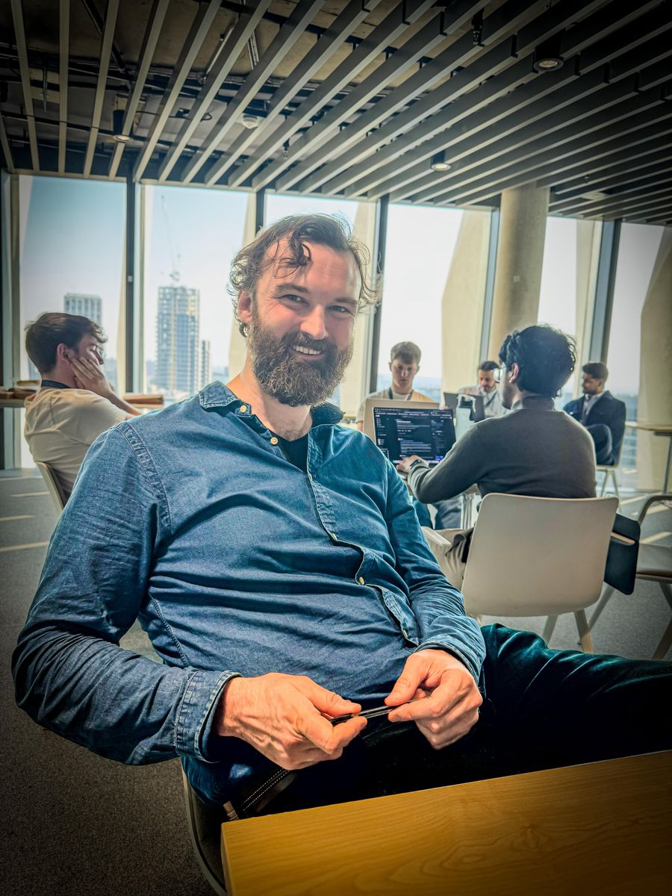
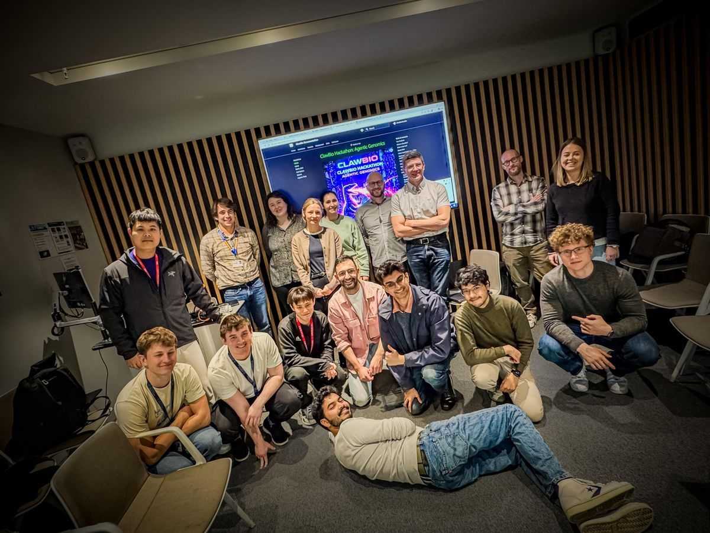

# ClawBio Hackathons: Agentic Genomics

{ width="100%" style="border-radius: 12px; margin-bottom: 1.5rem;" }

---

## Hackathon #1: Imperial College London

**19 March 2026 | Sir Michael Uren Hub, White City Campus**

Our first hackathon brought together 70+ participants from across genomics, AI engineering, proteomics, clinical diagnostics, and epidemiology. In a single afternoon, attendees built and submitted 8 new bioinformatics skills as pull requests to ClawBio.

<div class="grid cards" markdown>

- 

    **Opening session.** Full room for the welcome talks at the Sir Michael Uren Hub.

- 

    **Manuel Corpas and Jay Moore** introduce ClawBio and the docs.clawbio.ai hackathon guide.

- 

    **Guided tutorial.** Walking through agentic tools and skill building, step by step.

- 

    **Build time.** Laptops open, skills taking shape across all five tracks.

- 

    **Breakout hacking** with sunset views over White City. Discussions on reproducibility, sensitive biodata, and the future of agentic genomics.

- 

    **Jay Moore** (Imperial) between mentoring rounds.

</div>

{ width="100%" style="border-radius: 12px; margin: 1rem 0;" }

**Group photo** at the end of the day.

### By the numbers

| Metric | Value |
|--------|-------|
| Registrants | 99+ |
| Attended | 70+ |
| Skill PRs submitted | 8 |
| GitHub stars (day of event) | 468 |
| Forks | 83 |
| Repo views (14 days) | 10,972 |
| Unique cloners | 645 |
| Tracks | 5 (AI engineers, genomics, proteomics, clinical, epi) |

### Skills submitted on the day

| Skill | Author | Description |
|-------|--------|-------------|
| PubMed Summariser | @emanueleriontino | PubMed research briefing from gene or disease query |
| Protocols.io Bridge | @camlloyd | Search and retrieve lab protocols |
| Skill Builder | @thepigdestroyer | Scaffold new ClawBio skills from spec |
| Variant Annotation | @toby-clark4 | Annotate variants with ClinVar and gnomAD |
| Variant Annotation | @HadiKhan-dev | Alternative variant annotation approach |
| Bioconductor Bridge | @HDash | Doc-enriched Bioconductor package discovery |
| FHIR PGx | @MarceloGal | Fetch electronic clinical pharmacogenomics data |
| Clinical Trial Finder | @Duvet05 | Find clinical trials with multiple output formats |

### Institutions represented

Imperial College London, King's College London, The Crick Institute, UCL, QMUL, University of Westminster, Brunel University, PUCP Peru, FinalDose.ai, Canos.ai, Vivid-Dx, Flow.bio, FLock.io, Valink Tx, Inforcer

### Watch the recording

<div style="text-align: center; margin: 1.5rem 0;">
<iframe width="100%" height="450" src="https://www.youtube.com/embed/HofzUH7pmQM" title="ClawBio Hackathon #1: Agentic Genomics | Imperial College London" frameborder="0" allow="accelerometer; autoplay; clipboard-write; encrypted-media; gyroscope; picture-in-picture" allowfullscreen style="border-radius: 12px; max-width: 800px;"></iframe>
</div>

Organised by **Jay Moore** (Imperial), **Manuel Corpas** (Westminster), **Nathan Skene** (Imperial), and **Josh Beale**.

---

## Join the next one

We are planning more hackathons in 2026. To get notified:

- Join [Discord](https://discord.gg/EEp4Neaz)
- Follow [ClawBio on GitHub](https://github.com/ClawBio/ClawBio) (star and watch)
- Check [Luma](https://luma.com/clawbio) for event announcements

Want to host a ClawBio hackathon at your institution? [Open an issue](https://github.com/ClawBio/ClawBio/issues) or reach out on Discord.

---

## Hackathon Guide

Everything below is the reusable guide for participating in any ClawBio hackathon. It covers setup, skill building, and submission.

---

### The Problem

Modern bioinformatics knowledge is fragmented across papers, scripts, and private pipelines. Reproducing even simple analyses often requires reconstructing hidden decisions from incomplete documentation. Only about 1 in 4 computational biology papers can be reproduced without contacting the authors (Garijo et al., PLOS ONE 2013; Collberg and Proebsting, 2016). Meanwhile, general-purpose LLMs hallucinate gene-drug associations, use outdated clinical guidelines, and produce results with no audit trail.

### What is ClawBio?

ClawBio proposes a different unit of knowledge: a **skill** that packages the code, the scientific assumptions, the test data, and the execution contract in one inspectable artefact.

Each skill includes:

- A **SKILL.md** contract that explains the scientific decisions the tool makes (thresholds, databases, safety rules)
- **Demo data** that anyone can run without their own files
- A **Python script** with `--input`, `--output`, and `--demo` flags
- A **reproducibility bundle**: `commands.sh`, `environment.yml`, and `checksums.sha256`

SKILL.md is not just documentation. It is the contract that tells humans and AI agents how the skill should be used, what assumptions it makes, and when it should refuse to run.

---

### Who is this for?

| You are... | You already know | You do not need to know | Good first project |
|------------|-----------------|------------------------|--------------------|
| **AI / software engineer** | APIs, Python, automation | Any biology or genomics | [PubMed Summariser](projects/pubmed-summariser.md), [Clinical Trial Finder](projects/clinical-trial-finder.md) |
| **Genomics researcher** | VCFs, pipelines, domain expertise | Agentic AI or SKILL.md | [Variant Annotation](projects/variant-annotation.md), [QC Report](projects/qc-report.md) |
| **Proteomics / multi-omics** | Mass spec, protein databases | ClawBio (no skills exist yet) | [Protein Interaction Mapper](projects/protein-interaction.md), [Protein Domain Annotator](projects/protein-domain.md) |
| **Clinical / diagnostics** | Variant classification, PGx | Agent frameworks | [PGx Interaction Checker](projects/pgx-interaction-checker.md) |
| **Epidemiology / public health** | Population data, outbreak analysis | Python scripting (helpers available) | [Vaccine Equity Scorer](projects/vaccine-equity.md), [GBD Visualiser](projects/gbd-visualiser.md) |

---

### Quick Path

<div class="tutorial-cards">

<a class="tutorial-card" href="setup/">
  <div class="tutorial-card__header">
    <span class="tutorial-card__number">01</span>
    <span class="difficulty-badge difficulty-badge--beginner">Beginner</span>
    <span class="time-estimate">10 min</span>
  </div>
  <h3 class="tutorial-card__title">Setup</h3>
  <p class="tutorial-card__desc">Clone repo, install dependencies, run a demo.</p>
</a>

<a class="tutorial-card" href="first-skill/">
  <div class="tutorial-card__header">
    <span class="tutorial-card__number">02</span>
    <span class="difficulty-badge difficulty-badge--beginner">Beginner</span>
    <span class="time-estimate">20 min</span>
  </div>
  <h3 class="tutorial-card__title">Your First Skill</h3>
  <p class="tutorial-card__desc">Scaffold a skill, write SKILL.md, add demo data.</p>
</a>

<a class="tutorial-card" href="add-python/">
  <div class="tutorial-card__header">
    <span class="tutorial-card__number">03</span>
    <span class="difficulty-badge difficulty-badge--intermediate">Intermediate</span>
    <span class="time-estimate">20 min</span>
  </div>
  <h3 class="tutorial-card__title">Add Python</h3>
  <p class="tutorial-card__desc">Implement the skill logic with a CLI endpoint.</p>
</a>

<a class="tutorial-card" href="submit/">
  <div class="tutorial-card__header">
    <span class="tutorial-card__number">04</span>
    <span class="difficulty-badge difficulty-badge--beginner">Beginner</span>
    <span class="time-estimate">10 min</span>
  </div>
  <h3 class="tutorial-card__title">Test and Submit</h3>
  <p class="tutorial-card__desc">Validate, test, open a PR.</p>
</a>

</div>

Most participants submit their first skill in **90 to 120 minutes**. First-time Git or GitHub users should allow extra time; helpers will be available throughout.

**Starter template**: copy `templates/SKILL-TEMPLATE.md` into your skill directory to get the correct structure immediately. See [Your First Skill](first-skill.md) for the full walkthrough.

**Example completed skill**: see the [NutriGx Advisor PR](https://github.com/ClawBio/ClawBio/pull/1) by @drdaviddelorenzo, the first community contribution.

---

### What counts as a successful submission?

- [ ] One new skill directory under `skills/`
- [ ] A `SKILL.md` with frontmatter (name, version, inputs, outputs) and three body sections (Domain Decisions, Safety Rules, Agent Boundary)
- [ ] Synthetic demo data (never real patient data)
- [ ] A runnable `--demo` command that produces output
- [ ] A pull request to [github.com/ClawBio/ClawBio](https://github.com/ClawBio/ClawBio)

That is it. A focused, well-documented skill with clear domain decisions is better than an ambitious but incomplete one.

---

### Three Themes

1. **Gaps in genomics tools**: What analyses are still manual, brittle, or unreproducible? Build a skill that fills one of those gaps.
2. **Trustworthy agentic approaches**: How do we make AI agents safe for biology? Encode domain decisions and safety rules into SKILL.md so agents execute with proven logic, not hallucinations.
3. **Accessible complexity**: Genomics data is vast and complex. Build skills that present results so clearly that a non-specialist can act on them.

---

### Resources

Two guided tutorials are available to get you started. Both paths converge at the same goal: a working skill you can submit as a PR.

<div class="tutorial-cards">

<a class="tutorial-card" href="agentic-tools/">
  <div class="tutorial-card__header">
    <span class="difficulty-badge difficulty-badge--intermediate">Intermediate</span>
    <span class="time-estimate">15 min</span>
  </div>
  <h3 class="tutorial-card__title">Agentic Tools Tutorial</h3>
  <p class="tutorial-card__desc">How AI coding agents work, setup options (GitHub Copilot, Claude Code, OpenCode), your first AI-assisted analysis, and context management tips.</p>
</a>

<a class="tutorial-card" href="setup/">
  <div class="tutorial-card__header">
    <span class="difficulty-badge difficulty-badge--beginner">Beginner</span>
    <span class="time-estimate">10 min</span>
  </div>
  <h3 class="tutorial-card__title">ClawBio Setup</h3>
  <p class="tutorial-card__desc">Clone ClawBio, run a demo skill, then build your own following the step-by-step guide.</p>
</a>

</div>

---

### Pre-event setup

```bash
# Clone the repo and run a demo
git clone https://github.com/ClawBio/ClawBio.git
cd ClawBio
pip3 install -r requirements.txt
python3 skills/pharmgx-reporter/pharmgx_reporter.py --demo
```

To submit your work you will need the **GitHub CLI** (`gh`). Install it if you don't have it:

```bash
brew install gh          # macOS
sudo apt install gh      # Debian / Ubuntu
winget install GitHub.cli # Windows
```

Then authenticate: `gh auth login`

If you prefer not to install `gh`, you can submit your PR through the GitHub web interface instead. Both routes are covered in the [Submit](submit.md) guide.

---

### Choose Your Track

We have attendees ranging from AI agent engineers with no genomics background to researchers with 40+ years in computational biology. Pick the track that fits you. Each project is labelled as a **90-minute build** (achievable in the afternoon) or a **stretch build** (ambitious, likely a prototype).

#### Track A: AI Engineers New to Genomics

You build agents, automation, and APIs professionally. You just haven't touched genomic data before. These skills let you apply your engineering strengths to biology using public APIs, no wet-lab knowledge required.

**90-minute builds:**

- [PubMed Research Summariser](projects/pubmed-summariser.md)
- [Clinical Trial Finder](projects/clinical-trial-finder.md)
- [Variant Frequency Dashboard](projects/variant-frequency.md)
- [Protein Domain Annotator](projects/protein-domain.md)

**Stretch builds:**

- [Drug Label Parser](projects/drug-label-parser.md)
- [Multi-Database Aggregator](projects/multi-db-aggregator.md)

#### Track B: Genomics Researchers New to Agentic AI

You work with genomic data daily. Wrap your existing expertise into a skill.

**90-minute builds:**

- [QC Report Generator](projects/qc-report.md)
- [Gene Set Enrichment](projects/gene-set-enrichment.md)
- [Differential Expression Wrapper](projects/de-wrapper.md)

**Stretch builds:**

- [Variant Annotation Pipeline](projects/variant-annotation.md)
- [Single-Cell Cluster Annotator](projects/cell-type-annotator.md)

#### Track C: Proteomics and Multi-Omics

ClawBio currently has zero proteomics skills. Build the first one.

**90-minute builds:**

- [Protein Interaction Mapper](projects/protein-interaction.md)
- [Protein Domain Annotator](projects/protein-domain.md)

**Stretch builds:**

- [Mass Spec QC Skill](projects/mass-spec-qc.md)
- [Phosphoproteomics Enricher](projects/phospho-enricher.md)

#### Track D: Clinical and Diagnostic Applications

**All clinical track outputs are educational prototypes only. They must not be used for clinical decision-making or patient management.**

**90-minute builds:**

- [Pharmacogenomics Interaction Checker](projects/pgx-interaction-checker.md)

**Stretch builds:**

- [ACMG Variant Classifier](projects/acmg-classifier.md)
- [Diagnostic Yield Calculator](projects/diagnostic-yield.md)
- [Tumour Mutational Burden](projects/tmb-calculator.md)

#### Track E: Epidemiology and Public Health

**90-minute builds:**

- [Vaccine Equity Scorer](projects/vaccine-equity.md)
- [GBD Disease Burden Visualiser](projects/gbd-visualiser.md)

**Stretch builds:**

- [Outbreak Phylogenetic Clusterer](projects/outbreak-clusterer.md)
- [Antimicrobial Resistance Profiler](projects/amr-profiler.md)

---

### Judging Criteria

| Criterion | Weight |
|-----------|--------|
| Domain correctness | 40% |
| Reproducibility | 25% |
| Usefulness | 20% |
| Code quality | 15% |

---

### Communication

- **Primary channel**: [Discord](https://discord.gg/EEp4Neaz) for technical help, PR reviews, and community
- **GitHub**: [ClawBio/ClawBio Discussions](https://github.com/ClawBio/ClawBio/discussions) for skill proposals and longer-form questions
