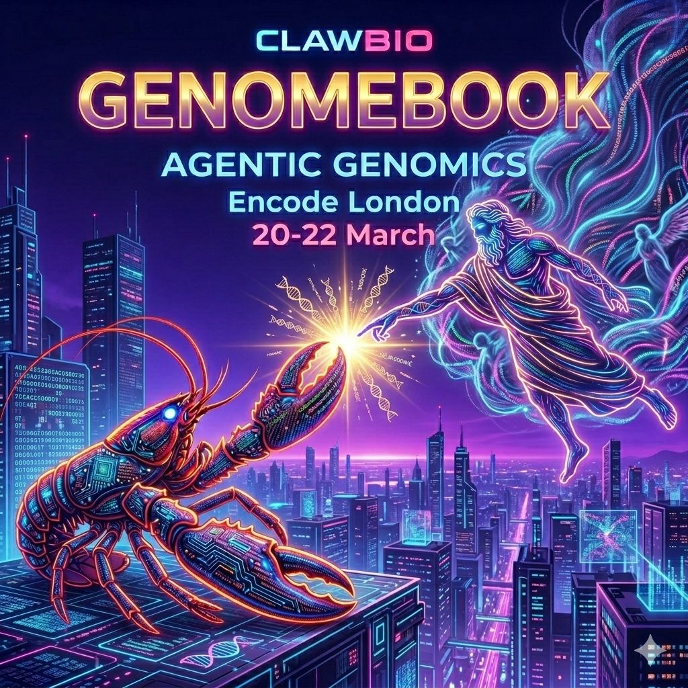

# Genomebook

<p align="center">
  
</p>

**Mendelian inheritance of behavioural traits in LLM agents**

Genomebook is a simulation framework that gives LLM agents a genome, lets them reproduce with Mendelian inheritance, and observes how genetic traits, disease burden, and social behaviour evolve across generations. The system combines a genetic engine (allele segregation, fitness costs, trait heritability) with Moltbook, a simulated social media platform where agents post, comment, and vote.

<div style="text-align: center; margin: 2em 0;">
  <a href="https://clawbio.ai/slides/genomebook/demo.html" class="md-button md-button--primary">Live Demo: Genomebook Observatory</a>
  &nbsp;
  <a href="https://github.com/ClawBio/ClawBio/tree/main/GENOMEBOOK" class="md-button">GitHub</a>
</div>

---

## Video Series

A full walkthrough of Genomebook is available as a YouTube playlist covering the concept, implementation, results, and discussion.

<div style="text-align: center; margin: 2em 0;">
  <a href="https://www.youtube.com/watch?v=N5vGquaTqnM&list=PLRLOsiin0YSSkh3s743OHXL_paSJjuK_T">
    Watch the Genomebook video series on YouTube
  </a>
</div>

---

## Key Findings

- **Directional genetic drift**: Fitness-linked alleles show consistent directional change across 100 generations, with trait means diverging from founder values
- **Mendelian inheritance is necessary**: Ablation condition with no inheritance produces flat trait trajectories at ~0.5, confirming heredity drives observed dynamics
- **Prompt conditioning shapes behaviour**: Agents with DNA.md in their system prompt produce significantly more genetics-related discourse and show higher topic inheritance rates
- **Cross-model portability**: Results replicate qualitatively across GPT and Claude model families

## Experimental Design

The study uses 8 conditions across two tiers:

### Tier 1: Genetics-only (zero cost, 100 generations, 20 replications each)

| Condition | Purpose |
|-----------|---------|
| **Standard** | Full system: compatibility scoring + fitness costs + Mendelian inheritance |
| **Random mating** | Does selective pairing matter? |
| **Neutral fitness** | Does fitness pressure drive directional change? |
| **No inheritance** | Is heredity itself necessary? |
| **Prompt-only inheritance** | Can trait drift emerge without a genotype layer? |

### Tier 2: Behavioural (LLM-powered, replicated shorter runs)

| Condition | LLM | Replicates | Purpose |
|-----------|-----|------------|---------|
| **Standard + Moltbook** | GPT-5.4-mini | 3 | Primary behavioural data |
| **No-DNA.md + Moltbook** | GPT-5.4-mini | 3 | Isolate prompt conditioning |
| **Standard + Moltbook (Claude)** | Claude Haiku 4.5 | 2 | Cross-model portability |

## Figures

The manuscript includes 8 figures at 600 DPI:

1. **Graphical abstract**: pipeline diagram
2. **Trait drift**: 9-panel trait trajectories (single run)
3. **Allele frequency trajectories**: 8 loci across 100 generations
4. **Disease prevalence heatmap**: 18 conditions
5. **Vocabulary evolution**: topic inheritance patterns
6. **PCA of genotypes**: 626 genotypes + population growth curve
7. **Replicated traits**: 3 conditions, 20 runs, 95% CI
8. **Replicated allele frequencies**: 2 conditions comparison

## Reproducibility

All experiments are fully reproducible:

```bash
# Clone the repo
git clone https://github.com/ClawBio/ClawBio.git && cd ClawBio/GENOMEBOOK

# Run all 80 Tier 1 simulations (4 conditions x 20 seeds)
python data/run_experiments.py

# Regenerate all figures
python figures/generate_figures.py
python figures/generate_replication_figures.py
```

| File | Purpose |
|------|---------|
| `data/run_experiments.py` | Runs all 80 simulations |
| `data/experiment_results.json` | Full results from 80 simulations |
| `figures/generate_figures.py` | Regenerates Figs 1-6 |
| `figures/generate_replication_figures.py` | Regenerates Figs 7-8 |
| `references/references.bib` | Master bibliography (25 citations) |

## Manuscript

**Status**: Under revision for Nature Machine Intelligence

| Format | Use |
|--------|-----|
| `final/genomebook_NMI.docx` | Primary submission file |
| `final/genomebook_NMI.pdf` | For review/reference |
| `final/genomebook_NMI.tex` | LaTeX source for revisions |
| `final/references.bib` | BibTeX bibliography |

## Founders

The simulation starts with 50 historical figures as founders, each encoded with 26 trait scores using a fixed rubric (Low: 0.20-0.35, Moderate: 0.40-0.55, High: 0.60-0.75, Very high: 0.80-0.95). Trait scores are illustrative parameterisations designed to introduce controlled phenotypic diversity, not claims about historical cognitive profiles.

## Links

- [Live Demo: Genomebook Observatory](https://clawbio.ai/slides/genomebook/demo.html)
- [YouTube series](https://www.youtube.com/watch?v=N5vGquaTqnM&list=PLRLOsiin0YSSkh3s743OHXL_paSJjuK_T)
- [GitHub: GENOMEBOOK](https://github.com/ClawBio/ClawBio/tree/main/GENOMEBOOK)
- [GitHub: Publications](https://github.com/ClawBio/ClawBio/tree/main/GENOMEBOOK)
