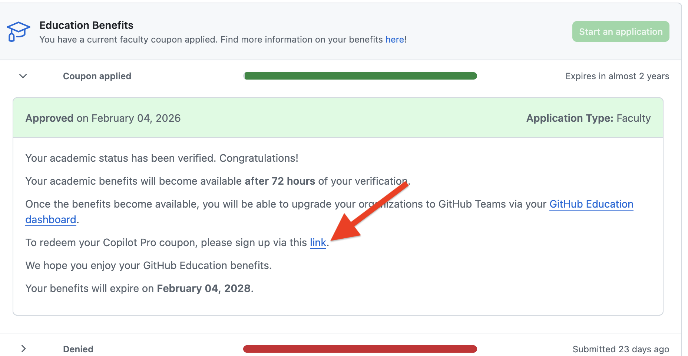
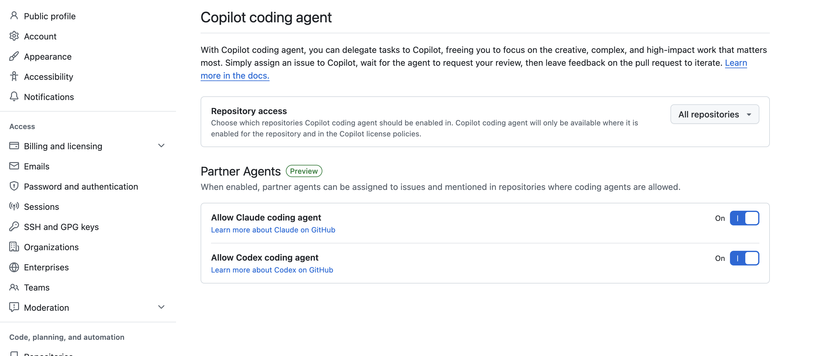
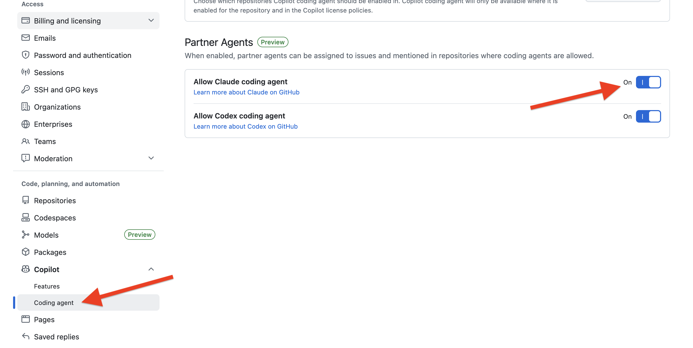

# GitHub Education — Free Copilot Access

  Beginner
  ~10 min

GitHub Education gives verified students and faculty free access to GitHub Copilot Pro, which unlocks powerful AI models including Anthropic's Claude.

[:fontawesome-brands-youtube: Watch the video tutorial](https://www.youtube.com/watch?v=mZh3Vw9bh-0){ .md-button }

---

## What You'll Learn

- How to apply for GitHub Education benefits
- How to redeem your free Copilot Pro coupon
- How to enable the Copilot coding agent and Claude partner agent in GitHub settings

## Step 1 — Apply for GitHub Education

1. Go to [github.com/education](https://github.com/education) and click **Join GitHub Education**

   

2. Complete the application — you'll need an academic email address or proof of affiliation
3. Submit and wait for approval. Benefits become available within **72 hours** of verification

## Step 2 — Redeem Your Copilot Pro Coupon

1. Go to [github.com/settings/education/benefits](https://github.com/settings/education/benefits)
2. Look for the green **Coupon applied** bar — this confirms your application was approved

   

3. Click the link in the approval message: *"To redeem your Copilot Pro coupon, please sign up via this link"*
4. Follow the prompts to activate Copilot Pro on your account

## Step 3 — Enable the Copilot Coding Agent

1. Go to [github.com/settings/copilot/coding_agent](https://github.com/settings/copilot/coding_agent)
2. Under **Repository access**, choose which repositories the coding agent can act on (you can set this to **All repositories**)

   

## Step 4 — Enable Claude as a Partner Agent

1. On the same settings page, scroll down to the **Partner Agents** section
2. Toggle **Allow Claude coding agent** to **On**
3. Optionally toggle **Allow Codex coding agent** to On as well

   

## Step 5 — Use Copilot Models

With Copilot Pro active, you can now access Claude and other premium models through your AI coding tool:

1. Return to the [Setup tutorial](setup.md)
2. When configuring providers, select **GitHub Copilot**
3. You can now choose Claude Opus 4.5 and other models available through your Copilot subscription

## Tips

- Benefits are tied to your academic email — make sure it matches the email on your GitHub account
- The benefits page shows your coupon expiry date — reapply before it expires to avoid losing access
- The coding agent's repository access can be restricted to specific repos if you prefer not to grant access to all repositories
