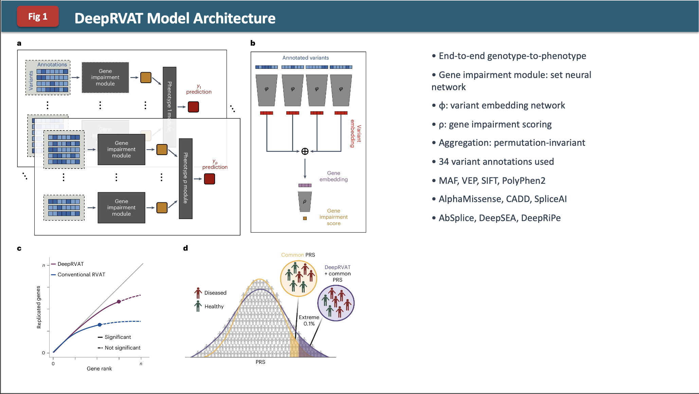

# Automated Presentations: From Papers to PowerPoint

<div class="tutorial-card__header">
  <span class="difficulty-badge difficulty-badge--intermediate">Intermediate</span>
  <span class="time-estimate">~25 min</span>
</div>

This tutorial shows how to use an AI coding agent to create a PowerPoint presentation from a scientific paper.

[:fontawesome-brands-youtube: Watch the video tutorial](https://www.youtube.com/watch?v=V6p3ArpIOQo){ .md-button }

---

## What You'll Learn

- How to summarise scientific papers into presentations
- How to include figures and key takeaways
- How to format slides for journal club

## Steps

You can run this in `Plan` mode to optimise the output. Here is a prompt for the paper [Integration of variant annotations using deep set networks boosts rare variant association testing](https://www.nature.com/articles/s41588-024-01919-z):

```
Make me 5-10 slide presentation for Journal club for this paper: https://www.nature.com/articles/s41588-024-01919-z
* Keep word usage low
* Include main figures
* summarise key take aways from paper
* output it as a powerpoint
```

## Results

Example slide:



## Observations

The formatting is a bit funky and it is not too in-depth.

## Challenge

What changes in the prompt or in `Plan` mode would you add to make a better output?

Some ideas:

- Ask for specific slide templates or layouts
- Request speaker notes for each slide
- Specify the audience level (beginner, advanced, etc.)
- Ask for a consistent colour scheme or theme
- Request more detailed figure annotations

---

## Advanced: Getting Skills with APM

The presentation above works, but the output can be improved significantly by using a **skill** — a reusable prompt template that teaches the agent how to do a specific task well.

### Why skills matter

Skills give the agent domain-specific knowledge so it doesn't have to figure everything out from scratch each time. The difference is significant:

| | With skill | Without skill |
|---|---|---|
| Workflow | Automatic execution | User provides instructions each time |
| Interaction | 2 clarifying questions | 15 back-and-forth messages |
| Failed API calls | 0 | 3 requiring retry |
| Tokens consumed | ~6,000 | ~12,000 |

Skills cut cost, reduce errors, and produce better output with less effort.

### Getting skills from Anthropic

Anthropic maintain a library of official skills at [github.com/anthropics/skills](https://github.com/anthropics/skills), including a [`pptx` skill](https://github.com/anthropics/skills/tree/main/skills/pptx) that generates polished PowerPoint files directly.

Instead of manually downloading skills, you can use the **Agentic Package Manager (APM)** to install them in one command. APM is a dependency manager for AI agent context — think npm or pip, but for prompts, instructions, and skills. See the [APM tutorial](apm.md) for the full guide.

### Install APM

```bash
curl -sSL https://raw.githubusercontent.com/microsoft/apm/main/install.sh | sh
```

### Install the pptx skill

From your project directory:

```bash
apm init                                          # creates apm.yml if you don't have one
apm install anthropics/skills/skills/pptx         # install the pptx skill
apm compile --target claude                       # generate CLAUDE.md with the skill included
```

### Use the skill

Restart your Claude Code session (skills are loaded at startup), then invoke it with:

```
/pptx Make me a 5-slide journal club presentation for this paper: <url>
```

Instead of writing Python/`python-pptx` code, Claude handles the entire presentation creation end-to-end using the skill's built-in template and logic.

### Browse more skills

You can explore the full Anthropic skills library for other useful capabilities:

```bash
# Browse what's available
apm search anthropics/skills
```

Or visit [github.com/anthropics/skills](https://github.com/anthropics/skills) directly to see all available skills.
