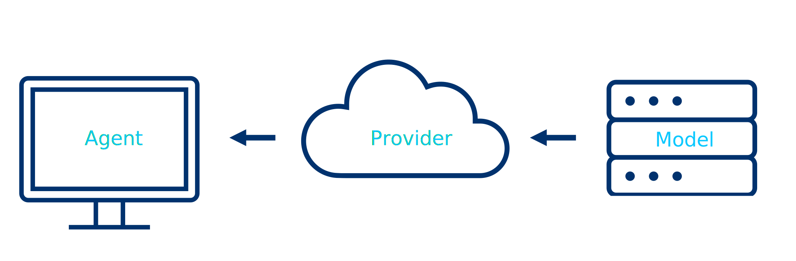

# Getting Started with AI Coding Tools

  Beginner
  ~20 min

Coding agents are distinct from chatbots because they can read and write files on your computer. This tutorial explains the stack and gets you set up.

[:fontawesome-brands-youtube: Watch the video tutorial](https://www.youtube.com/watch?v=qXYD9_I7_A0){ .md-button }

---

## How AI Coding Tools Work

A coding agent is not a single thing — it is a stack of three layers:

{ .svg-light-bg }

- **Agent** — the program on your computer (or in the cloud) that reads your files, runs commands, and writes code. Examples: GitHub Copilot, Claude Code, OpenCode.
- **Provider** — the service that hosts and serves the AI model. Examples: GitHub, Anthropic, OpenRouter.
- **Model** — the large language model that actually generates the code. Examples: Claude Opus 4.5, GPT-4.1, Kimi K2.5.

You choose an agent, connect it to a provider, and pick a model. Different combinations have different privacy and cost implications:

{ .svg-light-bg }

!!! note
    Free models on OpenRouter may train on your interactions. If data privacy is important, use a paid model or check the model's training policy on OpenRouter before use.

---

## Tools

There are three AI coding tools worth knowing about. "Downloading" one of these tools means installing a program on your computer that can read and write files in your project folder, run terminal commands, and interact with APIs — it is not just a chatbot, it is a coding agent that operates on your local files.

---

### GitHub Copilot (Recommended — free for students)

[GitHub Copilot](https://github.com/features/copilot) is GitHub's AI coding assistant. It runs inside VS Code and gives you access to top models (Claude Opus 4.5, GPT-4.1, Gemini) through your GitHub account — no separate API key needed.

**What downloading it means:** You install the GitHub Copilot extension inside VS Code. This adds an AI chat panel and inline code suggestions directly in your editor. The models run on GitHub's servers; the extension just connects your editor to them.

**Why we recommend it:** Free with [GitHub Education](https://education.github.com), gives access to multiple frontier models, and integrates directly into VS Code where you already write code.

---

### GitHub Codex

[Codex](https://github.com/features/codex) is GitHub's cloud-based coding agent. Unlike Copilot (which works alongside you in VS Code), Codex runs autonomously in a cloud sandbox — you give it a task and it works independently, then opens a pull request with its changes.

**What downloading it means:** There is nothing to download. Codex runs entirely in the browser at github.com. You open a repository on GitHub, click the Codex tab, and assign it tasks. It clones your repo into a cloud environment, makes changes, and submits them as a PR for you to review.

---

### Claude Code

[Claude Code](https://docs.anthropic.com/en/docs/claude-code) is Anthropic's terminal-based coding agent. It runs in your terminal (command line) and operates directly on your local files.

**What downloading it means:** You install a command-line program (via `npm install -g @anthropic-ai/claude-code`). When you run `claude` in a terminal inside your project folder, it starts an interactive session where you chat with Claude and it can read, edit, and create files on your machine. Requires a paid Anthropic API subscription or access through a provider.

---

### OpenCode + OpenRouter (alternative)

[OpenCode](https://opencode.ai/) is an open-source desktop app that provides a similar agent interface. It can connect to many model providers, including [OpenRouter](https://openrouter.ai) (a single subscription to access many models) and GitHub Copilot.

**What downloading it means:** You download a desktop application. It provides a chat interface that can read and write files in your project, similar to Claude Code but with a graphical interface and support for multiple providers.

---

## Installation — GitHub Copilot (Recommended)

> For a detailed step-by-step walkthrough with screenshots — including applying for GitHub Education, redeeming your Copilot Pro coupon, and enabling the coding agent — see the [GitHub Education guide](github-education.md).

1. Sign up for [GitHub Education](https://education.github.com) with your university email to get Copilot Pro free
2. Install [VS Code](https://code.visualstudio.com/) if you don't have it
3. Open VS Code → Extensions (sidebar) → search "GitHub Copilot" → Install
4. Sign in with your GitHub account when prompted
5. Open the Copilot Chat panel (sidebar icon or `Ctrl+Shift+I` / `Cmd+Shift+I`)
6. Select a model (e.g. Claude Opus 4.5) from the model picker at the top of the chat
7. Make a new folder to begin — e.g. create a `testing AI` folder in your Documents, then open it in VS Code (`File → Open Folder`)
