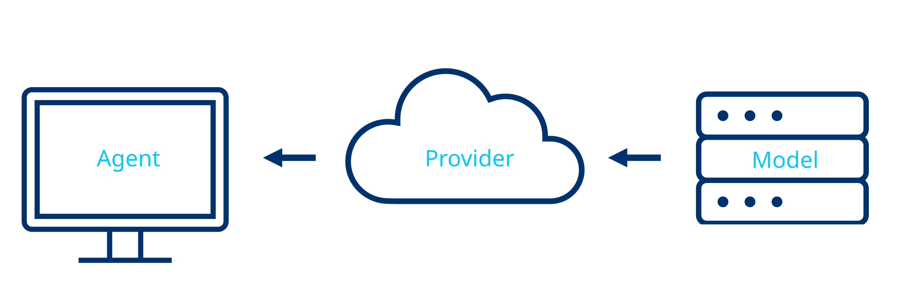

# Set Up an AI Coding Agent

<div class="tutorial-card__header">
  <span class="difficulty-badge difficulty-badge--beginner">Beginner</span>
  <span class="time-estimate">~15 min</span>
</div>

An AI agent is the fastest way into ClawBio if you do not code. You describe what you want in English; the agent installs the software, runs the analysis and reads the output back to you. This page explains what an agent is, helps you pick one, and gets it installed and signed in. The [landing page](../index.md#start-here) has the five-step short version; this is the full one.

---

## What an agent is

A chatbot answers questions. An agent also acts on your computer: it can read and write files in a folder, run programs, and check what they produced. Under the hood there are three layers.

{ .svg-light-bg }

- **Agent**: the program on your machine that reads files and runs commands. Claude Code, Codex, GitHub Copilot and OpenCode are agents.
- **Provider**: the company serving the model. Anthropic, OpenAI, GitHub, OpenRouter.
- **Model**: the language model doing the reasoning. Claude, GPT, Gemini, and open-weight models such as Qwen.

Most people pick the agent from the company they already pay, and never think about the other two layers. That is fine.

!!! note "Privacy"
    Your prompts and any file the agent reads go to the provider. Paid consumer plans from Anthropic and OpenAI state that they do not train on your data by default; check the current policy before uploading anything sensitive. Free models on OpenRouter may train on your interactions. Never give an agent a genome you are not allowed to share; the ClawBio demos ship with public data for exactly this reason.

---

## Choose an agent

| Agent | Made by | You need | Best for |
|---|---|---|---|
| **Claude Code** | Anthropic | Claude Pro, Max, Team or Enterprise | The route the ClawBio tutorials assume. Skills install as a plugin. |
| **Codex** | OpenAI | ChatGPT Plus, Pro, Business or Enterprise | Same idea, OpenAI's models. |
| **GitHub Copilot** | GitHub | A GitHub account; free for students via [GitHub Education](https://education.github.com) | Students. Runs inside VS Code with a graphical chat panel. |
| **OpenCode** | Open source | Any provider key, including [OpenRouter](https://openrouter.ai) | Open-weight or free models, or no vendor lock-in. |

Free Claude and free ChatGPT plans do not include the agent. If you are a student, Copilot is the zero-cost option and the [GitHub Education guide](github-education.md) walks through the sign-up with screenshots.

---

## Install

You need a terminal for one or two commands. On a Mac press ++cmd+space++, type **Terminal**, press ++enter++. On Windows press the Windows key, type **PowerShell**, press ++enter++ (your prompt starts with `PS C:\`). On Linux press ++ctrl+alt+t++.

=== "Claude Code"

    **Mac, Linux, WSL**

    ```bash
    curl -fsSL https://claude.ai/install.sh | bash
    ```

    **Windows PowerShell**

    ```powershell
    irm https://claude.ai/install.ps1 | iex
    ```

    Also available as `brew install --cask claude-code` on a Mac and `winget install Anthropic.ClaudeCode` on Windows. The native installer above updates itself; the other two do not.

    Open a **new** terminal and confirm:

    ```bash
    claude --version
    ```

    Prefer not to use a terminal at all? The [Claude Code desktop app](https://claude.com/download) gives you the same agent with a window and buttons.

    Requirements: macOS 13+, Windows 10 or later, or Ubuntu 20.04+; 4 GB RAM; an internet connection. Official docs: [code.claude.com/docs](https://code.claude.com/docs/en/setup).

=== "Codex"

    **Mac, Linux, WSL**

    ```bash
    curl -fsSL https://chatgpt.com/codex/install.sh | sh
    ```

    **Windows, or any machine with Node.js already installed**

    ```powershell
    npm install -g @openai/codex
    ```

    Open a **new** terminal and confirm:

    ```bash
    codex --version
    ```

    Official docs: [learn.chatgpt.com/docs/codex/cli](https://learn.chatgpt.com/docs/codex/cli).

=== "GitHub Copilot"

    1. If you are a student, get Copilot Pro free through [GitHub Education](https://education.github.com); the [step-by-step guide](github-education.md) covers it.
    2. Install [VS Code](https://code.visualstudio.com/).
    3. In VS Code open **Extensions** (left sidebar), search **GitHub Copilot**, click **Install**.
    4. Sign in with your GitHub account when asked.
    5. Open the Copilot Chat panel (++ctrl+shift+i++ on Windows and Linux, ++cmd+shift+i++ on a Mac) and switch it to **Agent** mode using the dropdown at the bottom of the chat box.
    6. Pick a model from the model picker. Claude models are available here too.

    There is no terminal command to install; the extension is the agent.

=== "OpenCode"

    Download the app from [opencode.ai](https://opencode.ai/), then add a provider. OpenRouter gives one key for many models, including free ones. Follow the app's own setup screen; the rest of this page applies unchanged.

---

## First session

Agents work inside one folder at a time. Make an empty one and start the agent in it. The first start opens your browser to sign in.

=== "Claude Code"

    ```bash
    mkdir clawbio-lab
    cd clawbio-lab
    claude
    ```

=== "Codex"

    ```bash
    mkdir clawbio-lab
    cd clawbio-lab
    codex
    ```

=== "Copilot"

    In VS Code choose **File, Open Folder**, create a folder called `clawbio-lab`, open it, then open the Copilot Chat panel.

Now paste this into the agent. It installs Python if you do not have it, installs ClawBio, runs a pharmacogenomics report on bundled public data, and explains it. Approve each action the agent proposes; that approval step is the safety rail, so read what it says before you say yes.

```text
I am a biologist with no programming experience. Please set up ClawBio for me
and run its first demo, explaining what you are doing in plain language.

1. Check whether Python 3.11 or newer is installed. If it is not, install it
   for my operating system and confirm it works.
2. Install ClawBio with: pip install clawbio
3. Run: clawbio run pharmgx --demo
4. Open the report it produces and explain the findings to me as you would to
   a colleague: which genes were tested, what each result means, and what the
   reproducibility bundle is for.
5. Then run: clawbio list
   and tell me which three skills you think I should try next and why.
```

The PharmGx demo runs in under two seconds and writes a Markdown report plus a `reproducibility/` folder holding the exact commands, environment and SHA-256 checksums. Every ClawBio skill produces that bundle; it is how you show a reviewer what was run.

### Let the agent know the skills exist

Once ClawBio is installed, any agent can run every skill through the `clawbio` command. To have the agent choose the right skill on its own:

- **Claude Code**: inside the session type `/plugin marketplace add ClawBio/ClawBio`, then `/plugin install clawbio`.
- **Codex, Cursor, VS Code, Zed**: each skill is a plain [Agent Skills](https://agentskills.io) folder. Copy the ones you want from `skills/` in the [repository](https://github.com/ClawBio/ClawBio) into `~/.agents/skills/`.

---

## If something goes wrong

- **`command not found` right after installing.** Close the terminal and open a new one; the installer changed a setting the old window has not read.
- **On Windows the install line prints an error about `&&` or `irm`.** You are in the other shell. `PS C:\` means PowerShell, plain `C:\` means CMD. Use the PowerShell command above from PowerShell.
- **The agent says Python is missing.** Let it install Python; that is what step 1 of the prompt is for. If it asks which version, say 3.12.
- **The browser sign-in never opens.** Copy the URL the agent prints into a browser yourself.
- **You are asked for an API key.** You do not need one on a Claude or ChatGPT subscription. Press ++esc++ and choose the sign-in-with-account option instead.

---

## Next steps

- [Run Your First Skill](run-your-first-skill.md): the ClawBio tutorial series starts here.
- [Variant Interpretation Workshop](variant-interpretation-workshop.md): a real human genome in Google Colab, no install at all.
- [Skill Library](../skills/index.md): every skill with its demo command.
