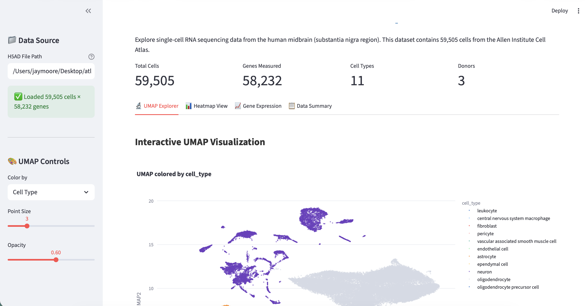

# Data Portal for Single Cell Sequencing

<div class="tutorial-card__header">
  <span class="difficulty-badge difficulty-badge--intermediate">Intermediate</span>
  <span class="time-estimate">~30 min</span>
</div>

Build an interactive viewer for single-cell RNA sequencing data using public datasets from the [CZ CELLxGENE](https://cellxgene.cziscience.com/) data portal.

[:fontawesome-brands-youtube: Watch the video tutorial](https://www.youtube.com/watch?v=VB-CsQeYs5o){ .md-button }

---

## Organise Project

1. Create a folder for your project on your computer
2. Create a data folder outside of your project folder

## Get Single-Cell Data

1. Browse the [CELLxGENE collections](https://cellxgene.cziscience.com/) and find a dataset. For this example we use the [Allen Institute Adult Human Brain Atlas](https://cellxgene.cziscience.com/collections/283d65eb-dd53-496d-adb7-7570c7caa443) — specifically the [midbrain (substantia nigra) snRNA-seq dataset](https://datasets.cellxgene.cziscience.com/5cfe2ee0-d62a-487c-b0fe-124f39f4df21.h5ad).

2. Download the `.h5ad` file to your laptop (it is 416.2 MB). The dataset contains 59,505 cells x 58,232 genes with 11 cell types across 3 donors. Key metadata columns include `cell_type`, `cluster_id`, `supercluster_term`, `donor_id`, and UMAP coordinates in `obsm['X_UMAP']`.

## Get Prompting

In `Plan` mode, type:

```
Build an interactive viewer for my single-cell RNA data. The file is at [path/to/data.h5ad].
```

## Result



## Publish to GitHub

Once your app is working, you can save it to GitHub:

### Install GitHub CLI

1. Download [GitHub CLI](https://cli.github.com/)
2. Authenticate: `gh auth login`

### Upload your code

In chat mode, ask:

```
Push my project to a new GitHub repository called [your-repo-name]
```

Or create a repo first:

```
Create a new private GitHub repository called [your-repo-name], then push my code to it
```

### Keep your context clean while working

Long sessions building and debugging your app will fill the context window quickly. Before pushing to GitHub, read the [Managing Context](context-management.md) tutorial to learn how to use `/compact`, maintain a `PLAN.md`, and avoid hallucinations on longer projects.
